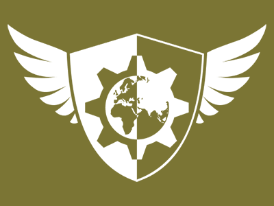
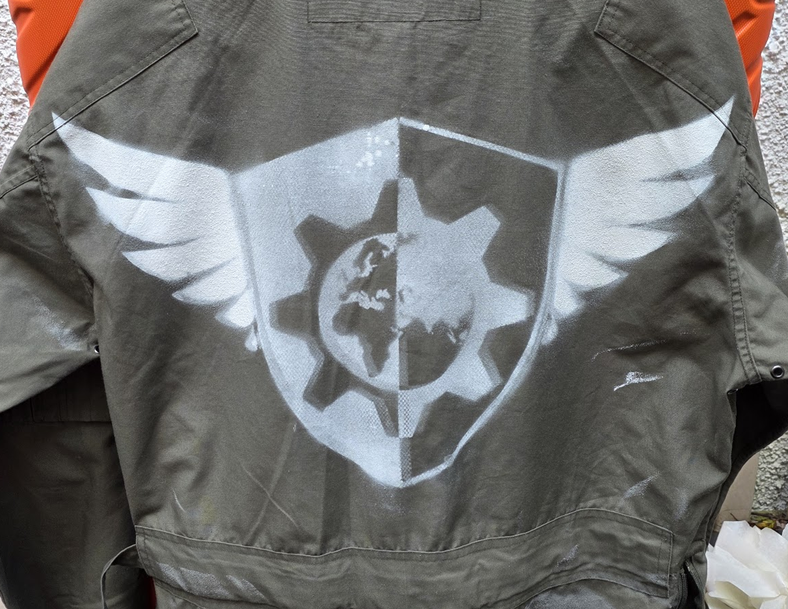
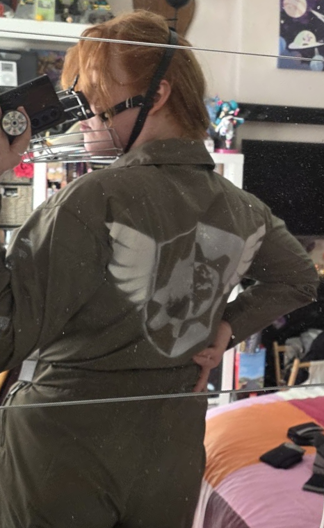

# Mechsplo Rebel Insignia

A rebel insignia inspired by Kallidora Rho's WARHOUND series, which I made to complement a costume piece.

Made by Caylee ([SpAM_CAN](https://bsky.app/profile/spamcan.bsky.social)/[cayvex](https://bsky.app/profile/cayvex.bsky.social)).

  

A few versions are included here:

- PNG ([black](PNG/rebel_insignia_black.png)/[white](PNG/rebel_insignia_white.png))
- [SVG](SVG/rebel_insignia.svg)
- [SVG Stencil](SVG/rebel_insignia_stencil.svg)
- STL Stencil ([single piece](STL/3dprintable_stencil_onepiece.stl), [left](STL/3dprintable_stencil_left.stl), [right](STL/3dprintable_stencil_right.stl)) - [see below on how to print these](#3D-Printing-Stencils)

### Background:

This came about while throwing together a Hound cosplay, based on my mental image of the characters _Sartha Thrace_, _Leinth Aritimis_ and _Amynta Tet_ in their varying rebel pilot attire. The rebel faction in WARHOUND, to my memory, didn't have a canonical faction insignia described in the stories, and I felt the flight suit and combat jacket I'd picked up looked a little blank without one, so I took it upon myself to throw one together.

I always liked pilot insignias that include wings, but given these stories are about mechs rather than aircraft, I wanted to include a big ol' gear in there somehow too. As the rebels are described as the defending faction (with the Empire descending from a space station prior to the events of the series), I figured a shield would be appropriate, and from there including the silhouette of the Earth within the gear felt like it completed the image - pilots shielding the earth using their mechanical monsters.

The vectors were authored or adapted by hand in Figma, and made **no use of AI tools.**

### Using 3D Printed Stencils:

Since I don't own a vinyl cutting machine or similar, I used what I did have (an FDM 3D printer). A technique inspired by [this video from Filament Stories](https://www.youtube.com/watch?v=3g0xSLlNmYc) on how to make scalemail for cosplay pieces, wherein you add a pause to the print gcode after a few layers, spread a layer of well-spaced fine fabric mesh taught over the print, then resume. This traps the mesh within the print, and for this purpose, allows for a stencil with floating parts. I recommend using masking/painters tape to affix the stencil to your garment, being sure to mask off areas you don't want sprayed, and potentially applying some double-sided tape to the under-side to affix the stencil firmer to the surface if you want a sharper image. You can then use a fabric spray paint (or airbrush) to paint the insignia following the instructions from the manufacturer (I used a can of [Pebeo 7A Fabric Spray Dye](https://www.amazon.co.uk/dp/B07RZCW7RQ)). A word of warning though: you use a mesh that's too thick, too dense, or has been used more than once, you might find that the outline of that mesh presents itself once sprayed onto the garment. Personally I liked that, it made it look even more worn, but that's up to your preference.

I could have applied the insignia with dye sublimation or heat-transfer vinyl, but I wanted a more world-worn aesthetic - these are seasoned mech pilots, and presumably this symbol was quickly applied in a ramshackle base at some point rather than professionally applied by a high-end printer or something. The spray paint look just feels right to me.

Note that I have a fairly large printer (Creality K2 Plus) and the split STL files provided are intended for a printer with that build volume (350mm x 350mm), sized to roughly cover shoulder-to-shoulder on the back of a flight suit or jacket (approximately 460mm x 265mm). I've included an STL for a complete stencil too if you've got a big enough machine. If you've got a smaller printer, you may need to split or size this yourself (ideally with some keying notches to make it easier for yourself to align and glue together). Most slicers support dropping a SVG in and extruding that, so you can modify the SVG using your vector tool of choice to split it into more chunks if you need it. If your slicer complains when trying to print an imported SVG, try exporting it as STL then reimporting it. No, I don't know why this works. Slicers are weird.

### License:

[Creative Commons BY 4.0](LICENSE) (but it'd be really cool if you tipped me on [Ko-fi](https://ko-fi.com/spam_can) if you sell stuff with this on)

### Thanks:

- [Kallidora Rho](https://bsky.app/profile/kallidorarho.bsky.social) for writing WARHOUND ([Amazon](https://www.amazon.co.uk/dp/B0FJT7DSNY/)/[itch.io](https://kallidorarho.itch.io/warhound-volume-one)) and kicking off the Mechsploitation genre
- The mechsplo girlies on Bluesky for showing off outfits that made me want to make one of my own
- [OpenClipart](https://openclipart.org) for some vectors I took as bases to adapt
- My partners and polycule, for being generous with feedback when I pinged them repeatedly with minor revisions
- whyrl, for encouragement and advice on boots and muzzles that were essential to making the whole outfit work